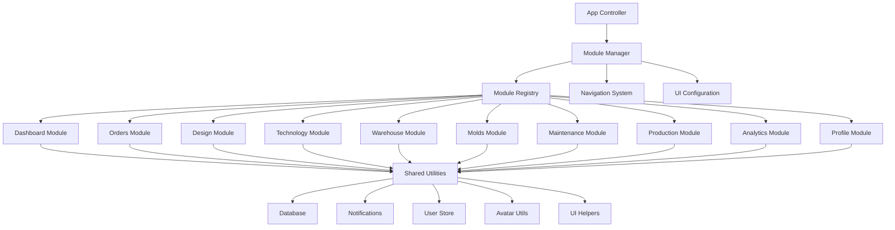

# ProcessCraft Modules System

> Comprehensive documentation of the modular architecture and module implementation in ProcessCraft

## 📋 Table of Contents

1. [Overview](#overview)
2. [Architecture](#architecture)
3. [Module Structure](#module-structure)
4. [Available Modules](#available-modules)
5. [Module Lifecycle](#module-lifecycle)
6. [Configuration System](#configuration-system)
7. [Navigation Integration](#navigation-integration)
8. [Adding New Modules](#adding-new-modules)
9. [Module Communication](#module-communication)
10. [Best Practices](#best-practices)
11. [Troubleshooting](#troubleshooting)

## 🎯 Overview

ProcessCraft implements a sophisticated modular architecture that allows for clean separation of concerns, maintainability, and scalability. Each functional area of the application is encapsulated within its own module, following consistent patterns and interfaces.

### Key Benefits
- ✅ **Modular Design**: Each feature is self-contained
- ✅ **Scalability**: Easy to add new modules
- ✅ **Maintainability**: Clear separation of concerns
- ✅ **Consistency**: Uniform structure across modules
- ✅ **Reusability**: Shared utilities and patterns

## 🏗️ Architecture



### Core Components

1. **App Controller** (`app.js`): Central application management
2. **Module Registry**: Centralized module instance storage
3. **Navigation System**: Dynamic navigation generation
4. **UI Configuration**: Centralized configuration management
5. **Shared Utilities**: Common functionality across modules

## 📦 Module Structure

Every module in ProcessCraft follows a standardized class-based structure:

```javascript
class ModuleName {
    constructor() {
        // Initialize module dependencies
        this.db = new Database();
        this.currentData = null;
        // ... other properties
    }

    init() {
        // Module initialization sequence
        this.render();
        this.setupEventListeners();
        this.loadData();
    }

    render() {
        // Generate and inject HTML content
        const moduleElement = document.getElementById(`${moduleName}-module`);
        moduleElement.innerHTML = `
            <!-- Module HTML structure -->
        `;
    }

    setupEventListeners() {
        // Bind event handlers to UI elements
        document.getElementById('button-id').addEventListener('click', () => {
            this.handleAction();
        });
    }

    async loadData() {
        // Load module-specific data
        try {
            const data = await this.db.getData();
            this.renderData(data);
        } catch (error) {
            console.error(`Error loading ${moduleName} data:`, error);
        }
    }

    // ... additional methods
}

// Global registration
window.ModuleName = ModuleName;
```

### Required Methods

| Method | Purpose | Required |
|--------|---------|----------|
| `constructor()` | Initialize module instance | ✅ Yes |
| `init()` | Module initialization entry point | ✅ Yes |
| `render()` | Generate module UI | ✅ Yes |
| `setupEventListeners()` | Bind event handlers | ✅ Yes |

### Optional Methods

| Method | Purpose | Common Usage |
|--------|---------|--------------|
| `loadData()` | Load module data | Data-driven modules |
| `destroy()` | Cleanup on module switch | Resource management |
| `refresh()` | Refresh module content | Real-time updates |
| `export()` | Export module data | Reporting modules |

## 📚 Available Modules

### 📊 Dashboard Module
**File**: `src/renderer/js/modules/dashboard.js` (1.4KB)
**Purpose**: Main dashboard with KPI tracking and system overview

```javascript
class DashboardModule {
    constructor() {
        this.db = new Database();
    }

    init() {
        this.loadDashboardData();
        this.setupEventListeners();
    }

    async loadDashboardData() {
        // Load KPI data every 30 seconds
        const [activeOrders, inProduction, readyToShip, criticalTasks] = await Promise.all([
            this.db.getOrders({ status: 'active' }),
            this.db.getOrders({ status: 'in_production' }),
            this.db.getOrders({ status: 'ready' }),
            this.db.getTasks({ priority: 'critical' })
        ]);
        
        // Update UI elements
        document.getElementById('active-orders-count').textContent = activeOrders.length;
        // ... other updates
    }
}
```

**Features**:
- Real-time KPI cards
- Auto-refresh every 30 seconds
- Production status overview
- Critical task alerts

### 📋 Orders Module
**File**: `src/renderer/js/modules/orders.js` (18.0KB)
**Purpose**: Complete order management system

**Features**:
- Order creation and editing
- Customer management
- Status tracking
- Advanced filtering
- Export functionality
- Modal-based forms

**Key Components**:
- Order table with sorting
- Filter system (status, customer, search)
- CRUD operations
- Customer integration

### 🎨 Design Module
**File**: `src/renderer/js/modules/design.js` (1.5KB)
**Purpose**: Design documentation and version control

**Features**:
- Design document versioning
- 3D model management
- Material calculations
- File attachments

### 🔧 Technology Module
**File**: `src/renderer/js/modules/technology.js` (15.1KB)
**Purpose**: Technical specifications and material database

**Features**:
- Material database management
- Technical parameter settings
- Process documentation
- Equipment specifications

### 📦 Warehouse Module
**File**: `src/renderer/js/modules/warehouse.js` (21.8KB)
**Purpose**: Inventory and warehouse management

**Features**:
- Real-time inventory tracking
- Stock level monitoring
- Internal orders processing
- Receiving/shipping operations

### 🏭 Molds Module
**File**: `src/renderer/js/modules/molds.js` (23.7KB)
**Purpose**: Mold production planning and management

**Features**:
- 3D printing planning
- CNC operations scheduling
- Material request management
- Production tracking

### 🛠️ Maintenance Module
**File**: `src/renderer/js/modules/maintenance.js` (26.1KB)
**Purpose**: Equipment maintenance and repair management

**Features**:
- Maintenance scheduling
- Repair task tracking
- Equipment history
- Preventive maintenance planning

### 🏗️ Production Module
**File**: `src/renderer/js/modules/production.js` (1.4KB)
**Purpose**: Production workshop control

**Features**:
- Production planning
- Work instruction management
- Quality control monitoring
- Real-time status reporting

### 📈 Analytics Module
**File**: `src/renderer/js/modules/analytics.js` (1.5KB)
**Purpose**: Business intelligence and reporting

**Features**:
- Production metrics analysis
- Cost analysis and tracking
- Performance forecasting
- Custom reporting

### 👤 Profile Module
**File**: `src/renderer/js/modules/profile.js` (20.3KB)
**Purpose**: User profile management

**Features**:
- User information display
- Avatar management
- Cover image customization
- Profile settings

## 🔄 Module Lifecycle

### 1. Application Startup
```javascript
// app.js - Module initialization
initializeModules() {
    try {
        this.modules = {
            dashboard: new DashboardModule(),
            orders: new OrdersModule(),
            design: new DesignModule(),
            technology: new TechnologyModule(),
            warehouse: new WarehouseModule(),
            molds: new MoldsModule(),
            maintenance: new MaintenanceModule(),
            production: new ProductionModule(),
            analytics: new AnalyticsModule()
        };
        
        console.log('Модули инициализированы:', Object.keys(this.modules));
    } catch (error) {
        console.error('Module initialization error:', error);
    }
}
```

### 2. Module Registration
All modules are stored in the central `this.modules` object for:
- Lifecycle management
- Dependency injection
- State management
- Event coordination

### 3. Module Activation
```javascript
switchModule(moduleName) {
    try {
        // Deactivate current module
        document.querySelectorAll('.module-content').forEach(content => {
            content.classList.remove('active');
        });

        // Activate new module
        const moduleElement = document.getElementById(`${moduleName}-module`);
        moduleElement.classList.add('active');

        // Initialize module
        if (this.modules[moduleName] && typeof this.modules[moduleName].init === 'function') {
            this.modules[moduleName].init();
        }
    } catch (error) {
        console.error('Module switch error:', moduleName, error);
    }
}
```

### 4. Module States
- **Inactive**: Module exists but not displayed
- **Active**: Module is currently displayed and initialized
- **Loading**: Module is initializing or loading data
- **Error**: Module encountered an error during operation

## 🎛️ Configuration System

### UI Configuration (`ui_config.js`)

The centralized configuration system manages:

```javascript
window.UI_CONFIG = {
    // Navigation configuration
    nav: [
        { key: 'dashboard', title: 'Панель управления', subtitle: 'Сводка и KPI' },
        { key: 'orders', title: 'Управление заказами', subtitle: 'Клиенты, этапы, история' },
        { key: 'design', title: 'Конструкторский модуль', subtitle: 'Версии КД, 3D, упаковка' },
        // ... other modules
    ],

    // Icon configuration
    icons: {
        nav: {
            dashboard: 'layout-dashboard',
            orders: 'clipboard-list',
            design: 'layers',
            // ... other icons
        }
    },

    // Text localization
    texts: {
        modules: {
            dashboard: 'Панель управления',
            orders: 'Управление заказами',
            // ... other module texts
        }
    }
};
```

### Module Metadata Requirements

Based on project specifications, module metadata must include:
- **moduleId**: Safe string identifier (no path traversal characters like `../`)
- **moduleName**: Human-readable title for UI display

## 🧭 Navigation Integration

### Dynamic Navigation Generation

Navigation is generated dynamically from configuration:

```javascript
renderChromeFromConfig() {
    const cfg = window.UI_CONFIG;
    const sidebar = document.querySelector('aside nav');
    
    if (sidebar) {
        sidebar.innerHTML = cfg.nav.map(item => `
            <a href="#" class="nav-item group flex items-center gap-2 px-2 py-2 rounded-lg border border-white/5 hover:border-white/15 hover:bg-white/5 transition-colors" data-module="${item.key}">
                <div class="h-6 w-6 grid place-items-center rounded-md bg-white/[0.06]">
                    <svg data-lucide="${cfg.icons.nav[item.key]}" class="h-4 w-4"></svg>
                </div>
                <div class="flex-1">
                    <div class="text-[13px] font-medium text-white/90">${item.title}</div>
                    <div class="text-[11px] text-white/50">${item.subtitle || ''}</div>
                </div>
            </a>
        `).join('');
    }
}
```

### Navigation Event Handling

```javascript
setupNavigationListeners() {
    document.querySelectorAll('.nav-item').forEach(item => {
        item.addEventListener('click', this.handleNavigationClick.bind(this));
    });
}

handleNavigationClick(e) {
    e.preventDefault();
    const moduleName = e.currentTarget.dataset.module;
    this.switchModule(moduleName);
}
```

## ➕ Adding New Modules

### Step-by-Step Guide

#### 1. Create Module File
Create `src/renderer/js/modules/newmodule.js`:

```javascript
class NewModule {
    constructor() {
        this.db = new Database();
    }

    init() {
        this.render();
        this.setupEventListeners();
        this.loadData();
    }

    render() {
        const moduleElement = document.getElementById('newmodule-module');
        moduleElement.innerHTML = `
            <div class="module-header">
                <h1>New Module</h1>
            </div>
            <div class="module-content">
                <!-- Module content here -->
            </div>
        `;
    }

    setupEventListeners() {
        // Event handlers
    }

    async loadData() {
        // Data loading logic
    }
}

window.NewModule = NewModule;
```

#### 2. Add HTML Container
In `index.html`, add:

```html
<div id="newmodule-module" class="module-content"></div>
```

#### 3. Include Script
In `index.html`, add:

```html
<script src="js/modules/newmodule.js"></script>
```

#### 4. Update Configuration
In `ui_config.js`, add:

```javascript
// Add to nav array
{ key: 'newmodule', title: 'New Module', subtitle: 'Module description' }

// Add icon
icons: {
    nav: {
        // ... existing icons
        newmodule: 'icon-name'
    }
}

// Add text
texts: {
    modules: {
        // ... existing modules
        newmodule: 'New Module'
    }
}
```

#### 5. Register Module
In `app.js`, add to `initializeModules()`:

```javascript
this.modules = {
    // ... existing modules
    newmodule: new NewModule()
};
```

### Module File Size Guidelines

Based on existing modules:
- **Simple modules**: 1.4KB - 1.5KB (dashboard, design, production, analytics)
- **Medium modules**: 15KB - 18KB (technology, orders)
- **Complex modules**: 20KB - 26KB (profile, warehouse, molds, maintenance)

## 📡 Module Communication

### Shared Utilities

Modules communicate through shared utilities:

```javascript
// Database operations
this.db = new Database();
const data = await this.db.getData();

// Notifications
window.app.showMessage('Operation completed', 'success');

// User management
const currentUser = window.UserStore?.getCurrentUser();

// UI helpers
// Preferred: import avatar utilities as an ES module
// import { updateAvatarInDOM } from './utils/avatarUtils.js';
// updateAvatarInDOM('#avatar-container', user);
// Backward-compatible global is still available for older code:
// window.AvatarUtils.updateAvatarInDOM('#avatar-container', user);
```

### Event System

```javascript
// Broadcasting events
document.dispatchEvent(new CustomEvent('moduleDataUpdated', {
    detail: { module: 'orders', data: updatedData }
}));

// Listening for events
document.addEventListener('moduleDataUpdated', (e) => {
    if (e.detail.module === 'orders') {
        this.refreshRelatedData();
    }
});
```

### App-Level Communication

```javascript
// Access app instance
window.app.switchModule('orders');
window.app.showMessage('Message', 'type');
window.app.openModal(htmlContent);
```

## 🎯 Best Practices

### 1. Module Structure
- ✅ Follow consistent class structure
- ✅ Use descriptive method names
- ✅ Implement error handling
- ✅ Clean up resources in destroy()

### 2. UI Generation
- ✅ Use template literals for HTML
- ✅ Sanitize user input
- ✅ Use semantic HTML elements
- ✅ Follow accessibility guidelines

### 3. Data Management
- ✅ Use async/await for database operations
- ✅ Implement loading states
- ✅ Handle errors gracefully
- ✅ Cache frequently used data

### 4. Event Handling
- ✅ Use event delegation when possible
- ✅ Remove event listeners on cleanup
- ✅ Prevent default behaviors appropriately
- ✅ Throttle/debounce intensive operations

### 5. Configuration
- ✅ Centralize all UI text in `ui_config.js`
- ✅ Use configuration for module metadata
- ✅ Avoid hardcoded strings in UI
- ✅ Support localization patterns

### 6. Performance
- ✅ Lazy load heavy content
- ✅ Use efficient DOM queries
- ✅ Minimize DOM manipulations
- ✅ Implement virtual scrolling for large lists

## 🔧 Troubleshooting

### Common Issues

#### Module Not Loading
```javascript
// Check console for errors
console.log('Доступные модули:', Object.keys(this.modules));

// Verify module registration
if (!this.modules[moduleName]) {
    console.error('Module not registered:', moduleName);
}
```

#### Navigation Not Working
```javascript
// Check navigation setup
const navItem = document.querySelector(`[data-module="${moduleName}"]`);
if (!navItem) {
    console.error('Navigation item not found:', moduleName);
}
```

#### Module Container Missing
```javascript
// Verify HTML container exists
const moduleElement = document.getElementById(`${moduleName}-module`);
if (!moduleElement) {
    console.error('Module container not found:', `${moduleName}-module`);
}
```

### Debug Mode

Enable debug mode in development:

```javascript
// app.js
testModuleSwitching() {
    console.log('Доступные модули:', Object.keys(this.modules));
    
    // Test each module container
    const moduleNames = ['dashboard', 'orders', 'design', /* ... */];
    moduleNames.forEach(moduleName => {
        const container = document.getElementById(`${moduleName}-module`);
        const navItem = document.querySelector(`[data-module="${moduleName}"]`);
        console.log(`Модуль ${moduleName}:`, {
            container: !!container,
            navItem: !!navItem,
            moduleClass: !!this.modules[moduleName]
        });
    });
}
```

### Performance Monitoring

```javascript
// Monitor module initialization time
const startTime = performance.now();
this.modules[moduleName].init();
const endTime = performance.now();
console.log(`Модуль ${moduleName} инициализирован за ${endTime - startTime}мс`);
```

## 📈 Future Enhancements

### Planned Features
- **Module Hot Reloading**: Development-time module reloading
- **Module Dependencies**: Explicit dependency management
- **Module Lazy Loading**: Load modules on demand
- **Module Sandboxing**: Isolated module execution
- **Module API**: Standardized module communication
- **Module Testing**: Unit testing framework for modules

### Extension Points
- **Custom Module Types**: Support for different module patterns
- **Plugin System**: External module loading
- **Module Marketplace**: Community modules
- **Module Analytics**: Usage tracking and optimization

---

*This documentation covers the complete module system in ProcessCraft. For specific implementation details, refer to the individual module files and the main application controller.*